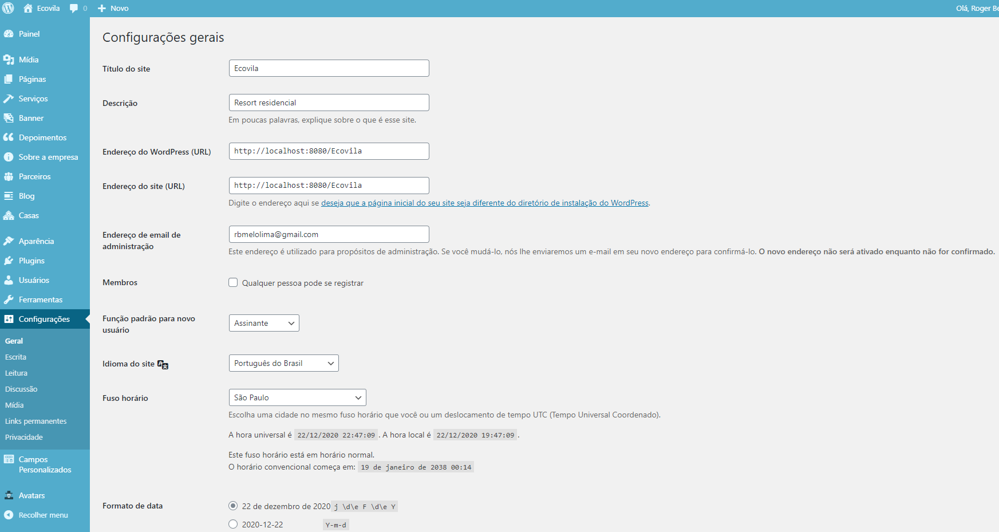
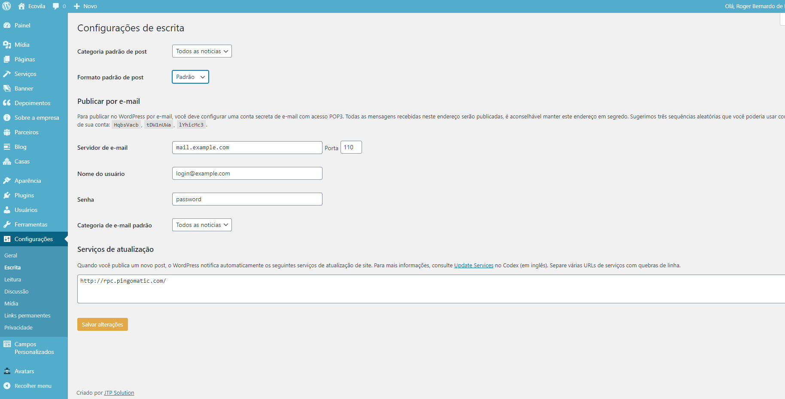
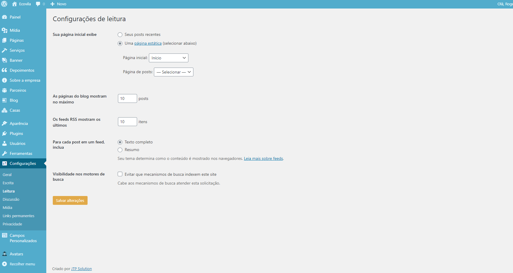
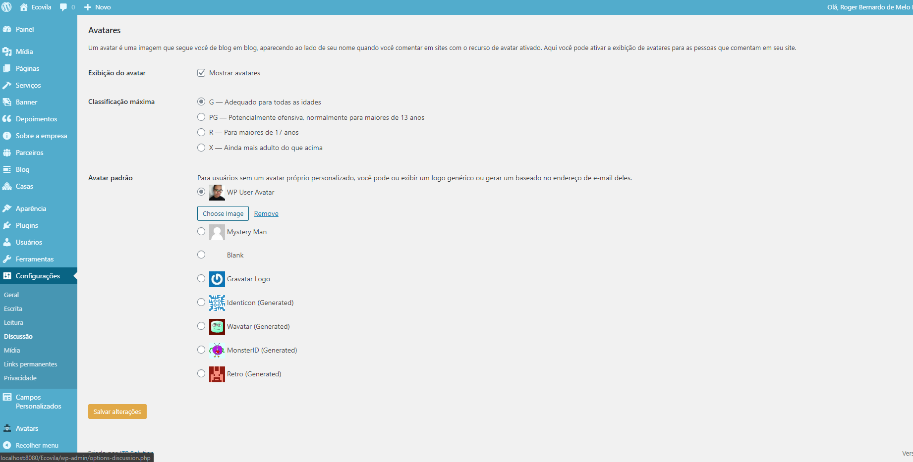
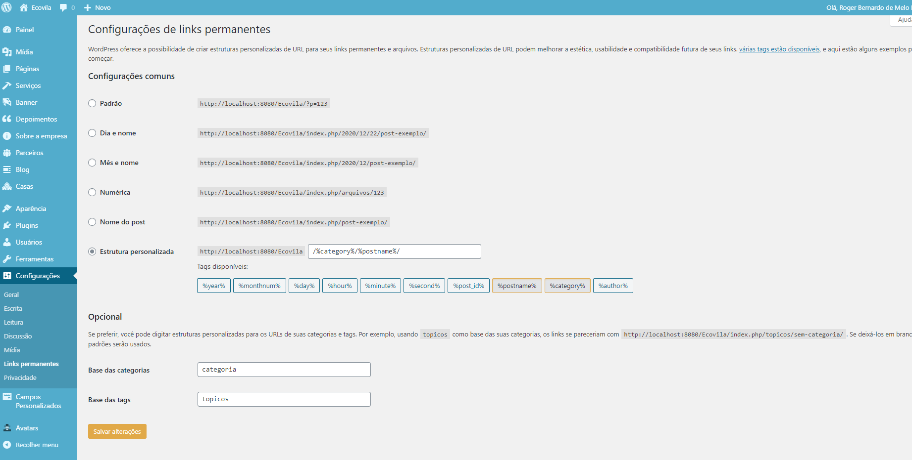
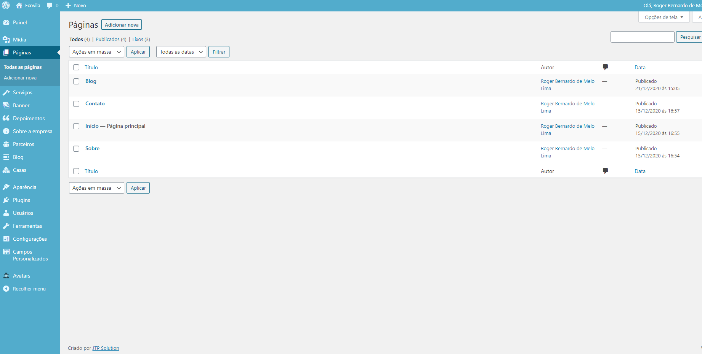

# Ecovila
> Um empreendimento pioneiro no Brasil quando o assunto é sustentabilidade. Com segurança, lazer e contato com a natureza, tendo a bela Praia Grande como pano de fundo.

Este é o guia de instalação e uso do tema da Ecovila.

## :crystal_ball: Passo a passo 
### :hammer: Instalação
1. Configure o php-mailer presente na página de contato com as informações do seu HOST

2. Instale o Wordpress

3. Suba esse tema no Wordpress

4. Baixe o (plugins) Advanced Custom Fields, ACF Photo Gallery Field, WP User Avatar

### :art: Personalização

#### :art: Editar css
O CSS foi feito a partir do SASS. 

0. Certifique-se se possuir o node e o npm instalado na sua máquina
1. Para compilar o SASS, deve-se instalar todas as dependências de desevolvimento com yarn ou npm
2. Digitar "gulp" no terminal
4. Editar livremente os arquivos SASS

#### :house_with_garden: Empresa
1.  Configure nome, descrição e logo
    "Aparência" > Personalizar > Identidade do site

2. Olhe no painel administrativo e identifique o "Informações sobre a empresa"
	Crie um **único** post, preenchendo corretamente todos os dados da empresa.

#### :page_facing_up: Páginas
1. Crie as páginas:
  - Início    (Defina como página inicial)
  - Blog      (slug: blog)
  - Contato   (slug: contato)
  - Sobre     (slug: sobre)

2. Vá até configurações
  - Entre em links permanentes
  - Clique em estrutura personalizada
  - No input, digite: /%category%/%postname%/
  - No campo "Base das categorias", digite "categorias"
  - No campo "Base das tags", digite "topicos"
  - Salve as alterações
  
#### :busts_in_silhouette: Escritores
1. Configure os escritores (Foto, nome, descrição)

## :trophy: Populando o site
Todos os procedimentos a seguir são feitos no painel administrativo.

### Início
Crie o texto que será exibido na página inicial. Aquele famoso "sobre a empresa".

Estrutura: 
1. Título (h1)
2. Subtítulo (h2)
3. Separador (hr).
4. Conteúdo normal (p)
*Caso queira colocar links, coloque no fim do conteúdo, sozinho, pois o mesmo ficará centralizado na tela.*

### Banner
O banner é a imagem de destaque da página inicial. Cadastre cada slide individualmente, podendo colocar uma foto de fundo, títulos, paragráfos e links.

Coloque o link por último, em um paragráfo isolado.

### Serviços
Cada serviço é um post personalizado. Ele é composto de:

**Conteúdo 1:**
Esse conteúdo é disposto antes da galeria de fotos referentes ao serviço.
O design de conteúdo dele é: 
1. Título (h1)
2. Subtítulo (h2)
3. Separador (hr).
4. Conteúdo normal (p)
*Caso queira colocar links, coloque no fim do conteúdo, sozinho, pois o mesmo ficará centralizado na tela.*

**Galeria de fotos**
Essas são as fotos referentes ao serviço. Será disposto em forma de slide na página.

**Conteúdo 2**
Esse conteúdo é disposto depois da galeria de fotos referentes ao serviço.
Para mais informações volte e leia sobre o conteúdo 1.

**Código de incorporação de vídeo**
Caso queria colocar um iframe do youtube na página, vá até o vídeo desejado e copie no código de incorporação.
Exemplo: 
`<iframe width="1280" height="720" src="https://www.youtube.com/embed/5qap5aO4i9A" frameborder="0" allow="accelerometer; autoplay; clipboard-write; encrypted-media; gyroscope; picture-in-picture" allowfullscreen></iframe>`

**Conteúdo da chamada de destaque**
A chamada de destaque vai no final da página, antes do sitemap.
Deve obedecer exatamente essa estrutura: 
- Imagem;
- Título;
- Link (opcional).

**Imagem da chamada de destaque**
Insira uma imagem para a chamada de destaque. Não precisa ser muito grande.

### Depoimentos
Para criar um depoimento é simples!

**Imagem**
Foto da pessoa ou do logo da empresa que fez o depoimento

**Conteúdo**
Insira um título (nome da pessoa/empresa) e o conteúdo do depoimento. O texto e etc.
Se houver um link, coloque no final do texto ;)

### Parceiros
Cadastre o logo dos seus parceiros!

### Blog
#### Categorias
Cadastre as categorias das notícias

#### Tags
São os pontos chaves de cada notícia do seu blog

#### Notícia
Escreva tranquilamente sua notícia. Quando acabar, não se esqueça de 
- Definir uma imagem de destaque
- Coloque **UMA** categoria
- Coloque tags na sua notícia
- Não tem necessidade de por resumo, ok?

### Casas
Cada casa é um post personalizado. Ele é composto de:

**Conteúdo 1:**
Esse conteúdo é disposto antes da galeria de fotos referentes à casa.
O design de conteúdo dele é: 
1. Título (h1)
2. Subtítulo (h2)
3. Separador (hr).
4. Conteúdo normal (p)
*Caso queira colocar links, coloque no fim do conteúdo, sozinho, pois o mesmo ficará centralizado na tela.*

**Código de incorporação de vídeo**
Caso queria colocar um iframe do youtube na página, vá até o vídeo desejado e copie no código de incorporação.
Exemplo: 
`<iframe width="1280" height="720" src="https://www.youtube.com/embed/5qap5aO4i9A" frameborder="0" allow="accelerometer; autoplay; clipboard-write; encrypted-media; gyroscope; picture-in-picture" allowfullscreen></iframe>`

**Galeria de fotos**
Essas são as fotos referentes à casa. Será disposto em forma de slide na página.

**Conteúdo da chamada de destaque**
A chamada de destaque vai no final da página, antes do sitemap.
Deve obedecer exatamente essa estrutura: 
- Imagem;
- Título;
- Link (opcional).

**Imagem da chamada de destaque**
Insira uma imagem para a chamada de destaque. Não precisa ser muito grande.

**Diferenciais**
São 4 diferenciais por cada casa.

Cadastre uma imagem (ícone que simboliza o diferencial - deve ter 200px de largura -) e um título (nome do diferencial) logo abaixo.

## :house: Configurações do localhost

